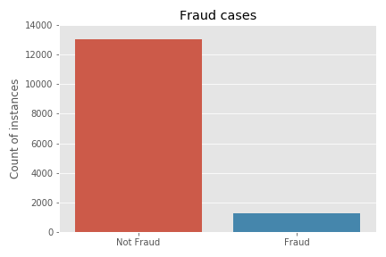
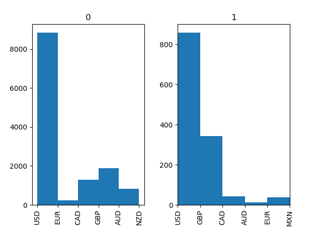
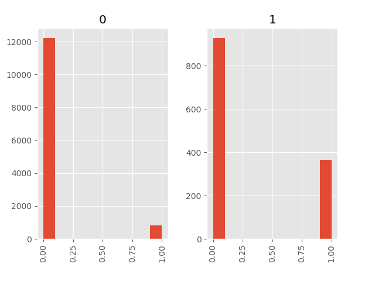
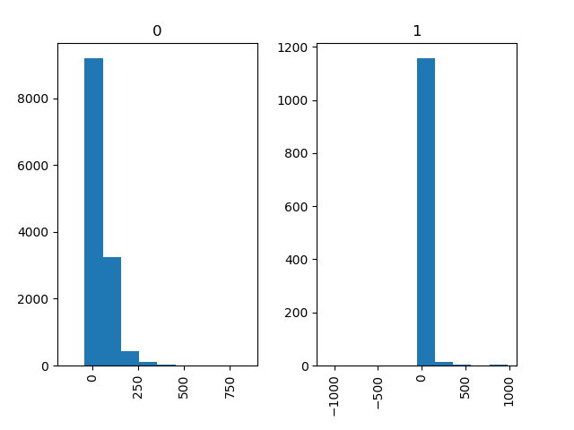
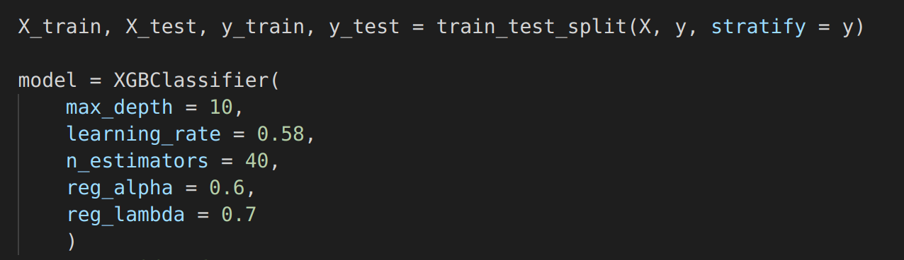
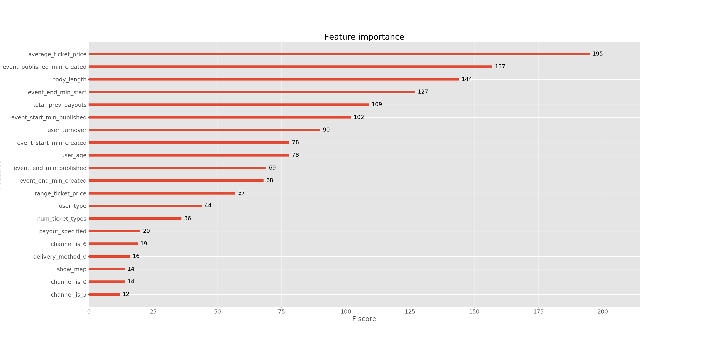
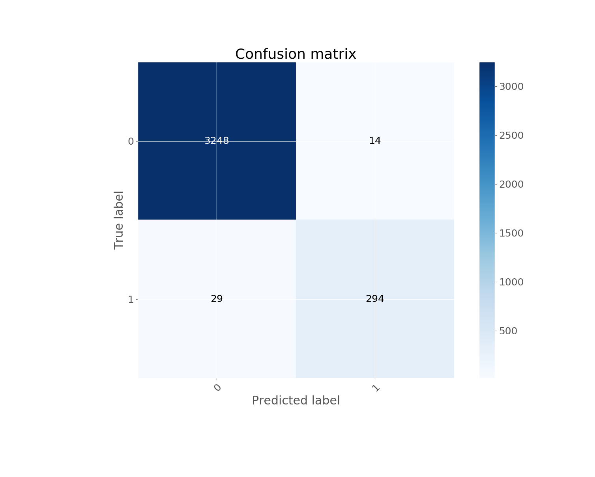
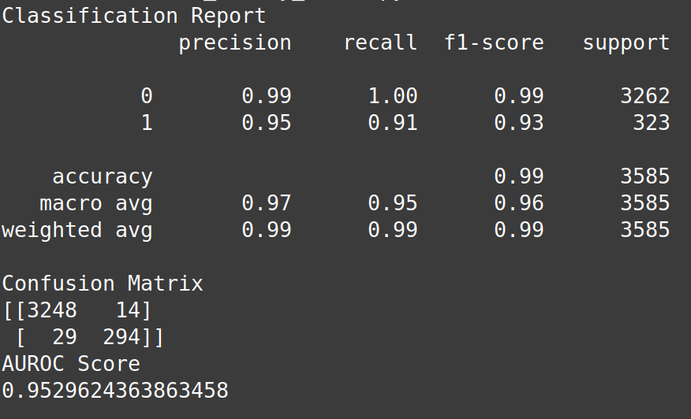
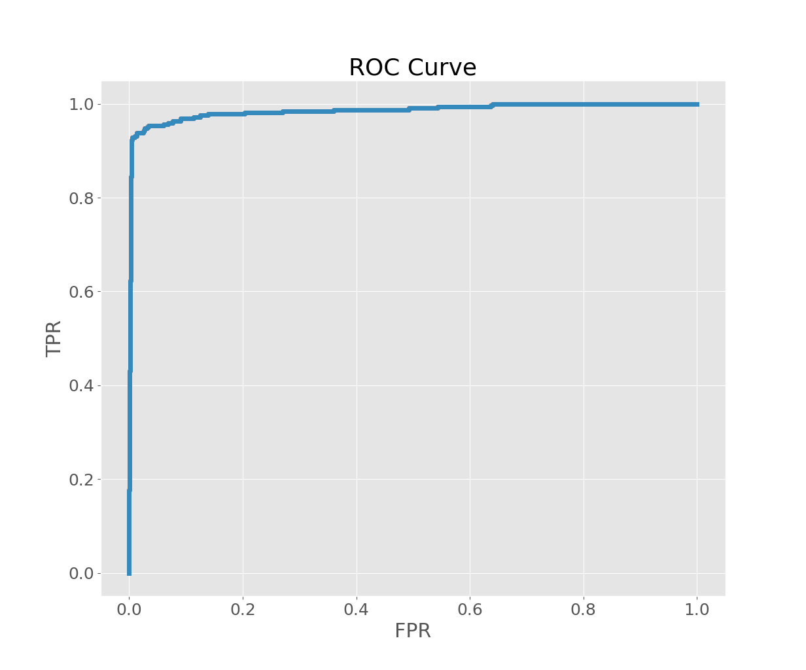

# Fraud Case Study

## Table of Contents

1. [Overview](#overview)
2. [Data](#data)
3. [First Glance](#first-glance)
4. [When are incidents occurring?](#when-are-incidents-occurring?)
5. [What is causing the increase in the Fall?](#what-is-causing-the-increase-in-the-fall?)
6. [What next?](#what-next?)

##  Overview 

Evenbrite is an event management and ticketing website that focuses on the local markets. This local focus allows  event producers a convenient well designed to market and plan while also allowing the attendees a chance to support their community.  

There is a cost for the local focus. First,the ease of use to plan events and then sell/buy tickets makes them a prime target for fraud. Evenbrite must be vigilent to identify and prevent those events and miniimize financial loss but a fine line must be walked to make sure you don't reject a transaction that is good.  When there are only 25 tickets for an event, stopping a sale of 4 has a larger impact on the user base. 

As part of their effort to balance both demands, we have developed a new model to try to identify the transactions that need to be investigated for fraud. 

## Data 
One of tools Evenbrite provides to their event producers is a stream showing their ticket sales and how many channels were used for advertisement.  We obtained access to a database of past transactions that included markers of whether the transaction was fraudulent. 
The data was obtained through the eventbrite site [here](https://www.eventbrite.com/platform/api#/reference/event/retrieve). 

Due to the nature of the feed there were many features that would appeal to different users.  Our first task was to identify the key features we could use to develop a model.  One of the major issues was Evenbrite’s use of nested dictionaries in key fields, particularly the amount spent, by who, and when.  

Like most fraud, the data was highly imbalanced, with about a 90/10 split of Non-fraud/Fraud cases.  Since any model will naturally try to predict the largest class, the disparity had to be addressed. 

 

After trying upsampling and downsampling, we found that stratification of the original data provided the best representation of the data. 

While this poses it's own challenges, we feel that this is likely highly representative of the balance of non-fraud/fraud cases that occur so were not particularly concerned about this aspect of the data set.

Next we started the search for potentially viable features to build into our model. After much EDA, we found a few things we felt confident about moving forward with.

We can see here that nearly half of all fraudulent instances occur when the body_length feature is 0.

 

We also found that fraud was a higher percentage of total instances when advertised on 0, 5, or 6 channels.

### Currency by Fraud Status

 

We can see here that the GBP fraud instances are ~ 20% of the GBP transactions. Since this is well over the 10% of fraud instances in the total dataset, we would feel comfortable including this in further models.

### Currency Mismatch by Fraud

 

Similarily here, we can see that when there is a mismatch in currency being used to purchase a pass vs. the origin country of the transaction, there are higher instances of fraud. We would also include this in a later model.
### Sale Duration by Fraud

 

Similarily, 
## Model

We opted to use XGBoostClassifier for our model. It has a history of out performing other ensemble models, so we only spent our time with this particular one, but our pipeline should be easily capable of swapping to most other ensemble models for further testing.

### Model Specs

After much RandomizedSearchCV's, down to a final GridSearchCV, these were the final parameters (before featurizing more data, will need to fully tune again).

We did not opt to Upsample, Downsample, Sidesample, or Invert the data, but simply stratified the target feature. Due to this, we acknowledge that any accuracy score will not be useful.

## Results

### Starting with feature importance.

 

### Confusion Matrix

### Classification Report

 

### ROC

 

We feel really good about our model performance. It is suspiciously good, to the point that we are concerned we left in a feature that is leaking.

## Where to go from here
As part of evaluation and deployment, we would like to expand the model to handle and flag the stream in live time, as well as refine the current models features and hyperparameters

 